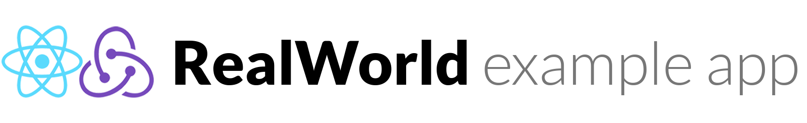

# RealWorld Example Application - CI/CD Using Azure DevOps - Jenkins -GitHub Actions

###### 


## Introduction
This repository contains the source code for a RealWorld example app that demonstrates how to set up a CI/CD pipeline using Azure DevOps. The app is a simple example of a RESTful API server built using Node.js and Express, and includes basic CRUD operations for articles and comments.


## Prerequisites
### For Azure DevOps
Before you can set up the CI/CD pipeline, you'll need to have an Azure DevOps account. If you don't already have one, you can sign up for free here.

### For Jenkins
Before you can set up the CI/CD pipeline, you'll need to have a Jenkins server set up. If you don't already have one, you can download Jenkins here and follow the instructions for installation.

## Setting up the CI/CD pipeline
### For Azure DevOps

To set up the CI/CD pipeline for this app, follow these steps:

1. Clone this repository to your local machine.

2. In Azure DevOps, create a new project and go to the Pipelines section.

3. Select the "New pipeline" button and choose "GitHub" as the source. Follow the prompts to link your GitHub repository to Azure DevOps.

4. Select the "Node.js" template and configure the pipeline as follows:

+ In the "Agent job" section, select "Node.js" as the agent pool.
+ In the "Variables" section, create the following variables:
   + NODE_ENV: Set this to production.
   + PORT: Set this to 3000.
+ In the "Stages" section, add the following steps:
   + A "Build" step that runs the command npm install to install the dependencies.
   + A "Test" step that runs the command npm test to run the tests.
   + A "Deploy" step that runs the command npm start to start the app.
Save the pipeline and run it to see if it works. If everything is set up correctly, the pipeline should run without errors and deploy the app to the specified environment.

### For Jenkins

To set up the CI/CD pipeline for this app, follow these steps:

1. Clone this repository to your local machine.

2. In Jenkins, go to the "New Item" page and create a new Freestyle project.

3. In the "Source Code Management" section, select "Git" as the source and enter the URL of your GitHub repository.

4. In the "Build Triggers" section, select "Poll SCM" and enter the following schedule: H/5 * * * * to build every 5 minutes.

5. In the "Build Environment" section, select "Provide Node & npm bin/folder to PATH".

6. In the "Build" section, add the following steps:

   + Execute shell command: npm install
   + Execute shell command: npm test
7. In the "Post-build Actions" section, add the following step:
   + Execute shell command: npm start
8. Save the project and build it to see if it works. If everything is set up correctly, the pipeline should run without errors and deploy the app to the specified environment.

### For GitHub Actions

Setting up the CI/CD pipeline
To set up the CI/CD pipeline for this app, follow these steps:

1. Go to the "Actions" tab in your GitHub repository.

2. Create a new workflow by clicking the "Set up a workflow yourself" button.

3. In the workflow file, copy and paste the following YAML code:

```
name: Docker Image CI

on:
  push:
    branches: [ "master" ]
  pull_request:
    branches: [ "master" ]

jobs:

  build:

    runs-on: ubuntu-latest

    steps:
    - uses: actions/checkout@v3
    - name: Build the Docker image
      run: docker build . --file Dockerfile --tag my-image-name:$(date +%s)
```
4. Save the workflow file.

5. Push a change to the repository to trigger the workflow and see if it runs successfully. If everything is set up correctly, the pipeline should run without errors and deploy the app to the specified environment.


[](http://realworld.io)


## Functionality overview

The example application is a social blogging site (i.e. a Medium.com clone) called "Conduit". It uses a custom API for all requests, including authentication. You can view a live demo over at https://redux.productionready.io/

**General functionality:**

- Authenticate users via JWT (login/signup pages + logout button on settings page)
- CRU* users (sign up & settings page - no deleting required)
- CRUD Articles
- CR*D Comments on articles (no updating required)
- GET and display paginated lists of articles
- Favorite articles
- Follow other users

**The general page breakdown looks like this:**

- Home page (URL: /#/ )
    - List of tags
    - List of articles pulled from either Feed, Global, or by Tag
    - Pagination for list of articles
- Sign in/Sign up pages (URL: /#/login, /#/register )
    - Use JWT (store the token in localStorage)
- Settings page (URL: /#/settings )
- Editor page to create/edit articles (URL: /#/editor, /#/editor/article-slug-here )
- Article page (URL: /#/article/article-slug-here )
    - Delete article button (only shown to article's author)
    - Render markdown from server client side
    - Comments section at bottom of page
    - Delete comment button (only shown to comment's author)
- Profile page (URL: /#/@username, /#/@username/favorites )
    - Show basic user info
    - List of articles populated from author's created articles or author's favorited articles

<br />

## Conclusion
By following these steps, you should have a working CI/CD pipeline for your RealWorld example app using Azure DevOps - Jenkins - GitHub Actions. This pipeline can be easily adapted to work with other Node.js applications and can be further customized to meet your specific needs.


[](https://thinkster.io)
